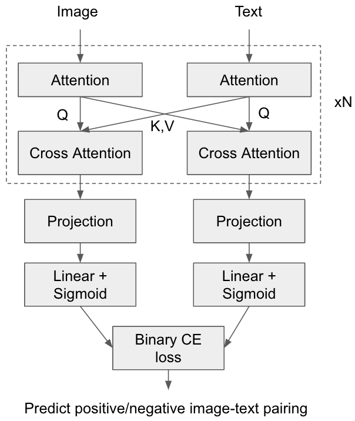
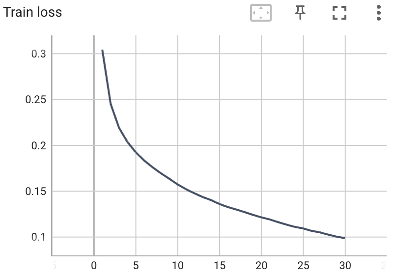
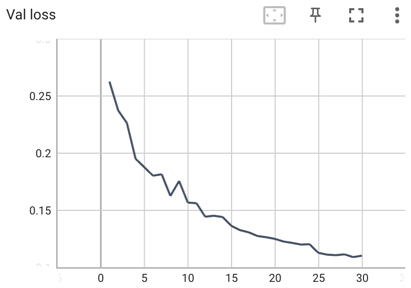

## Interleaved Cross Attention Model for Text-Image Pretraining

*Still a work-in-progress for additional validation and testing*

This repo implements a model that interleaves attention + cross-attention blocks as shown in the diagram. Here, one branch represents the visual modality and the other represents text. This work attempts to build image-text representations by interleaving cross-attention blocks from image and text branches of the model. This is in contrast to using a loss function at the end of the models (e.g., CLIP) to build correlations between the modalities. Instead, the goal is to test whether these correlations can be built at the attention level itself and whether they are more robust in zero-shot performance. This approach is inspired by methods like Flamingo (https://arxiv.org/abs/2204.14198) and SelfDoc (https://arxiv.org/abs/2106.03331).

The model is trained to distinguish between positive and negative image-text pairings with a simple binary cross-entropy loss.



## Running model training and evaluation on CIFAR10

Run model training and evaluation on CIFAR10 using:
```
python train.py
python eval.py
```

Validation with the provided model config and code achieved **~81% accuracy** on CIFAR10. Training logs for the run is shown below.

<p float="left">
  
   
</p>


## Acknowledgements
This code is based on two awesome repos: CLIP from OpenAI (https://github.com/openai/CLIP) and OpenAI-CLIP from moein-shariatnia (https://github.com/moein-shariatnia/OpenAI-CLIP). Thank you to the respective authors for open-sourcing their great work!


### TODO
- [ ] Optimize code to run more efficiently
- [ ] Add code for additional datasets
- [ ] Further validation and testing
