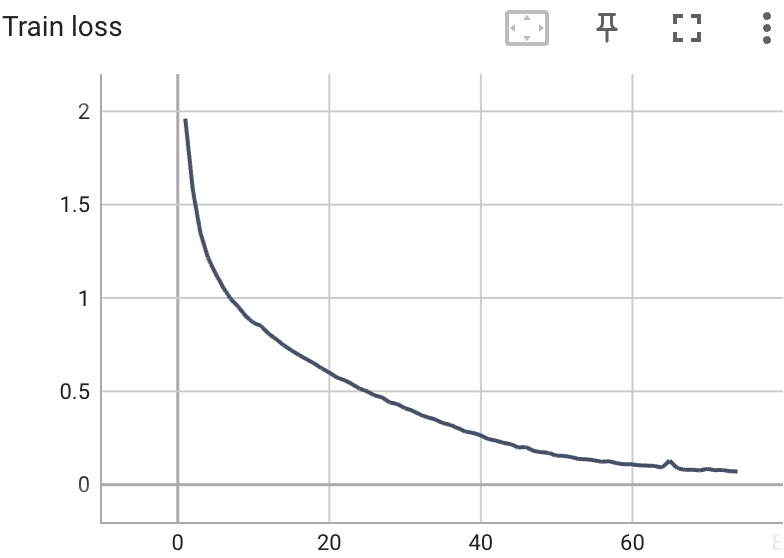
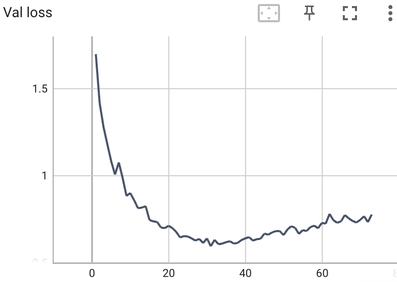

## Code for pretraining OpenAI CLIP model for CIFAR10

The code in this folder trains ViT and text encoder model from scratch for CIFAR10 dataset. This model is trained using the procedure described in OpenAI's CLIP paper (https://arxiv.org/abs/2103.00020). The architecture and config used are also contained in this folder. Run training and evaluation with:
```
python train_clip.py
python eval_clip.py
```
The training and validation logs from one run is shown below. The model achieves **~81.3% accuracy** on CIFAR10.

<p float="left">
  
   
</p>
